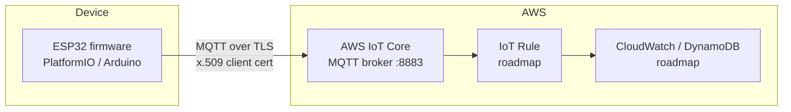

# ESP32 Telemetry → AWS IoT Core

[](https://github.com/jhocan55/esp32-aws-iot-telemetry/actions/workflows/ci.yml)

An ESP32 firmware that publishes device telemetry (uptime, free heap, Wi-Fi RSSI) to **AWS IoT Core** over MQTT/TLS — built the way production firmware is built: **CI pipeline on every push, infrastructure as code, least-privilege IoT policies, and no secrets in the repo**.

No external sensors required: any bare ESP32 devkit can run it.

## Architecture



## What this project demonstrates

- **Embedded C++**: Wi-Fi + TLS + MQTT client on ESP32, reconnect handling, JSON serialization
- **DevOps for firmware**: GitHub Actions builds every commit with PlatformIO and runs static analysis (`pio check`)
- **Infrastructure as Code**: the IoT Thing and its least-privilege policy are managed with Terraform
- **Security hygiene**: certificates and Wi-Fi credentials live in a gitignored `secrets.h`; the device may only connect as itself and publish to its own topic

## Quickstart

### 1. Provision the AWS side

```bash
cd terraform
terraform init && terraform apply

# Create the device certificate (private key is only shown once):
aws iot create-keys-and-certificate --set-as-active \
  --certificate-pem-outfile device.pem.crt \
  --private-key-outfile device.private.key

# Re-apply with the certificate attached:
terraform apply -var certificate_arn=<arn-from-previous-step>

# Get your account's MQTT endpoint:
aws iot describe-endpoint --endpoint-type iot:Data-ATS --query endpointAddress --output text
```

### 2. Configure the firmware

```bash
cp include/secrets.example.h include/secrets.h
# Fill in Wi-Fi credentials, the IoT endpoint, and paste the certificate + key
```

### 3. Build and flash

```bash
pip install platformio
pio run -e esp32dev -t upload && pio device monitor
```

Watch messages arrive in the AWS console: **IoT Core → MQTT test client → subscribe to `devices/esp32-telemetry-01/telemetry`**.

## Roadmap

- [ ] IoT Rule → CloudWatch metrics + alarm on device silence
- [ ] Real sensor (DHT22 temperature/humidity)
- [ ] OTA firmware updates via AWS IoT Jobs
- [ ] Grafana dashboard for the fleet
